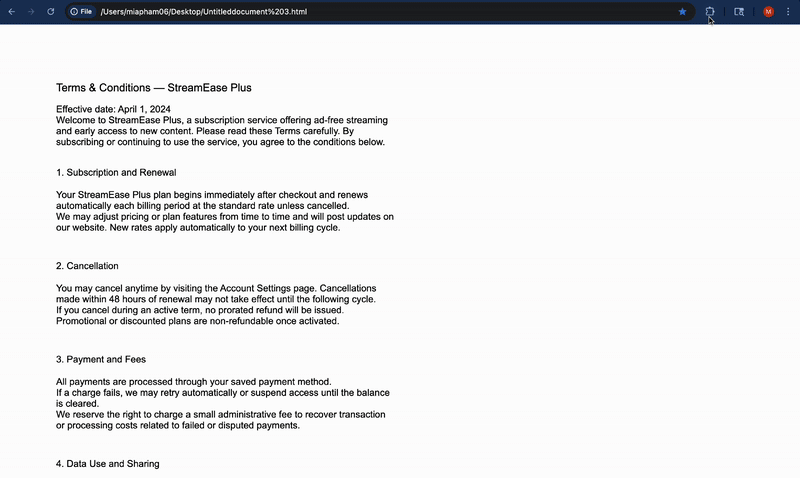

# T&C Decoder

> Never miss the fine print again. AI-powered Terms & Conditions analyzer that runs entirely in your browser.


## 📖 Overview

T&C Decoder is a Chrome extension that helps you understand Terms & Conditions, Privacy Policies, and other legal documents without reading pages of legalese. Using **local AI processing**, it highlights critical clauses and generates plain-English summaries—all without sending your data to external servers.

## Features

### 🎯 Smart Detection
- **Automatic keyword detection** for risky terms:
  - Fees & charges
  - Cancellation and auto-renewal policies
  - Data Sharing and Privacy risks
- **Risk severity scoring** (Low, Medium, High)

### 🤖 AI-Powered Summaries
- **100% local processing** - No external APIs, your data never leaves your device
- **Plain-English explanations** of complex legal terms
- **Top 5 key points** extraction for quick understanding
- Powered by [Transformers.js](https://huggingface.co/docs/transformers.js) and DistilBART

### 📅 Subscription Management
- **One-click calendar reminders** for cancellation deadlines
- Pre-filled Google Calendar events set 30 days out
- Never forget to cancel before auto-renewal again!

## 🎬 Demo


## 🚀 Installation

### From Source

1. **Clone the repository**
   ```bash
   git clone https://github.com/yourusername/tc-decoder.git
   cd tc-decoder
   ```

2. **Install dependencies**
   ```bash
   npm install
   ```

3. **Build the extension**
   ```bash
   npm run build
   ```

4. **Load in Chrome**
   - Open Chrome and navigate to `chrome://extensions/`
   - Enable "Developer mode" (toggle in top right)
   - Click "Load unpacked"
   - Select the `dist` folder from the project directory

## 💻 Usage

1. **Open the extension** - Click the T&C Decoder icon in your Chrome toolbar
2. **Navigate to any Terms & Conditions page**
3. **Click "Analyze This Page"** in the side panel
4. **Review the results:**
   - **Risk Overview**: Overall severity and key warnings
   - **AI Summary**: Top 5 important points in plain English
   - **Page Highlights**: Risky clauses highlighted in yellow
5. **Set a reminder** (optional) - Click the calendar button to add a cancellation reminder

## How It Works

### Architecture

```
┌─────────────┐
│   Website   │ ← User browses T&C page
└──────┬──────┘
       │
┌──────▼──────────┐
│ Content Script  │ ← Extracts text using Mozilla Readability
└──────┬──────────┘
       │
┌──────▼──────────┐
│ Service Worker  │ ← Orchestrates analysis flow
└─────┬─────┬─────┘
      │     │
      │     └─────────────┐
      │                   │
┌─────▼──────┐    ┌──────▼─────────┐
│ Rules Engine│    │ AI Summarizer │
│             │    │ (Offscreen)   │
│ • Regex     │    │               │
│ • Keyword   │    │ • DistilBART  │
│ • Scoring   │    │ • Local ONNX  │
└─────┬──────┘    └──────┬─────────┘
      │                   │
      └─────────┬─────────┘
                │
        ┌───────▼────────┐
        │   Side Panel   │ ← Displays results to user
        │   (React UI)   │
        └────────────────┘
```

### Key Technologies

- **Manifest V3** - Latest Chrome extension standard
- **React + Chakra UI** - Modern frontend framework
- **Transformers.js** - Browser-based ML inference
- **ONNX Runtime** - Optimized model execution
- **Mozilla Readability** - Clean text extraction
- **TypeScript** - Type-safe development

## 🛠️ Development

### Prerequisites
- Node.js 18+
- npm or yarn

### Development Build
```bash
npm run dev
```

### Production Build
```bash
npm run build
```

### Project Structure
```
tc-decoder/
├── src/
│   ├── App.tsx              # Side panel UI
│   ├── content.ts           # Content script (highlighting)
│   ├── service-worker.js    # Background orchestration
│   ├── offscreen.ts         # AI model runner
│   ├── rules.ts             # Risk detection engine
│   └── types.ts             # TypeScript definitions
├── public/
│   ├── manifest.json        # Extension manifest
│   ├── sidepanel.html       # Side panel entry
│   └── offscreen.html       # Offscreen document entry
└── dist/                    # Build output
```


## License

This project is licensed under the MIT License - see the [LICENSE](LICENSE) file for details.

## Acknowledgments

- [Transformers.js](https://github.com/xenova/transformers.js) by Xenova
- [Mozilla Readability](https://github.com/mozilla/readability)
- [Chakra UI](https://chakra-ui.com/) for the component library
- [DistilBART](https://huggingface.co/Xenova/distilbart-cnn-6-6) model by Hugging Face


---

<p align="center">Made with ❤️ for consumers who value their privacy and time</p>
